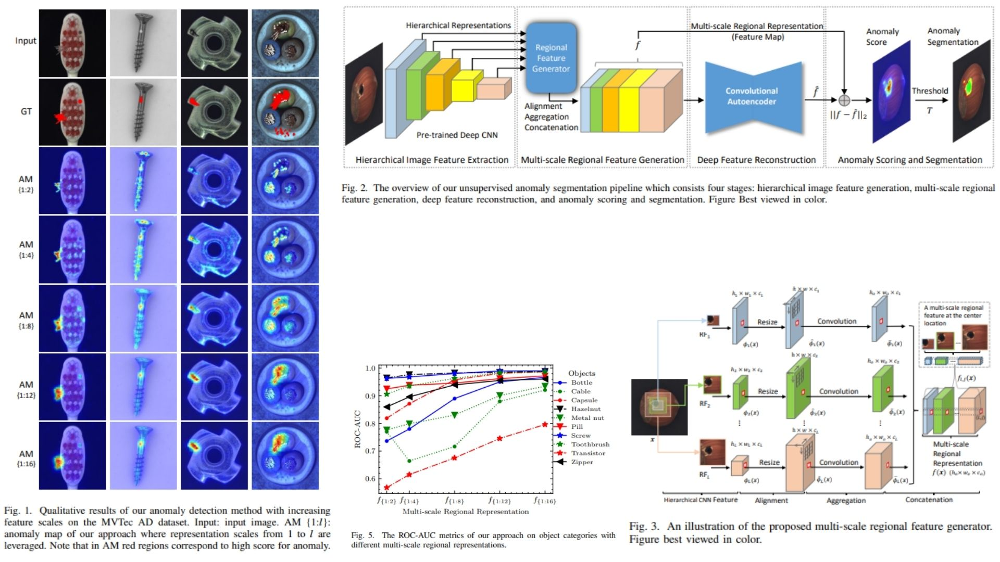

# 🖼️ DFR-Replication — Deep Feature Reconstruction for Anomaly Segmentation

This repository provides a **faithful Python replication** of the **Deep Feature Reconstruction (DFR) framework** for unsupervised anomaly segmentation.  
The code implements the pipeline described in the original paper, including **multi-scale hierarchical feature extraction, feature reconstruction, and anomaly scoring**.

Paper reference: *[Deep Feature Reconstruction for Unsupervised Anomaly Segmentation](https://arxiv.org/abs/2012.07122)*  

---

## Overview 🎨



> The pipeline extracts **hierarchical CNN feature maps**, generates **dense multi-scale regional features**, reconstructs them via a convolutional autoencoder, and produces **pixel-level anomaly maps** by comparing original and reconstructed features.

Key points:

* **Pretrained CNN backbone**: hierarchical feature maps $$\phi_l(x)$$ capture local to global information  
* **Multi-scale regional features**: aggregated and concatenated features $$f(x) = \text{cat}(\bar{\phi}_1, ..., \bar{\phi}_L)$$  
* **Feature reconstruction**: convolutional autoencoder outputs $$\hat{f}(x)$$  
* **Anomaly map**: $$A(i,j) = \|f_{i,j}(x) - \hat{f}_{i,j}(x)\|_2^2$$  
* **Segmentation**: thresholding anomaly scores to obtain pixel-wise anomaly regions  

---

## Core Math 📐

**Hierarchical feature alignment**:

$$
\hat{\phi}_l(x) = \text{resize}(\phi_l(x))
$$

**Aggregation**:

$$
\bar{\phi}_l(x) = \text{agg}(\hat{\phi}_l(x))
$$

**Multi-scale feature fusion**:

$$
f(x) = \text{cat}(\bar{\phi}_1(x), \bar{\phi}_2(x), ..., \bar{\phi}_L(x))
$$

**Reconstruction loss**:

$$
\mathcal{L}_{rec} = \frac{1}{H W C} \sum_{i,j,k} (f_{i,j,k}(x) - \hat{f}_{i,j,k}(x))^2
$$

**Anomaly map per pixel**:

$$
A(i,j) = \| f_{i,j}(x) - \hat{f}_{i,j}(x) \|_2^2
$$

**Final segmentation**:

$$
S(i,j) = 
\begin{cases} 
1 & \text{if } A(i,j) > \tau \\
0 & \text{otherwise} 
\end{cases}
$$

---

## Why DFR Matters 🌿

* Detects **pixel-level anomalies** without anomalous training data 🧩  
* Leverages **multi-scale hierarchical features** for robust detection of subtle defects  
* Produces **dense anomaly maps** suitable for segmentation or localization tasks  

---

## Repository Structure 🏗️

```bash
DFR-Replication/
├── src/
│   ├── backbone/
│   │   ├── pretrained_cnn.py        
│   │   └── feature_extractor.py     
│   │
│   ├── layers/
│   │   ├── resize_align.py          
│   │   ├── aggregation.py           
│   │   └── concatenation.py         
│   │
│   ├── modules/
│   │   ├── multi_scale_generator.py 
│   │   ├── feature_autoencoder.py   
│   │   ├── reconstruction_loss.py   
│   │   ├── anomaly_map.py           
│   │   └── segmentation.py          
│   │
│   ├── model/
│   │   └── dfr_model.py             
│   │
│   └── config.py                     
│
├── images/
│   └── figmix.jpg                    
│
├── requirements.txt
└── README.md
```

---

## 🔗 Feedback

For questions or feedback, contact:  
[barkin.adiguzel@gmail.com](mailto:barkin.adiguzel@gmail.com)
